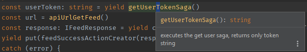
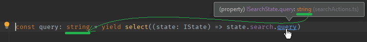

# Saga

## Yield return types

TS can't "return" types for interim yields, there are [hacks](https://github.com/redux-saga/redux-saga/issues/884) of course.

I usually use [JSDoc](https://jsdoc.app/tags-returns.html) to indicate a return type so that the IDE can help me.

```typescript
/**
 * executes the get user saga, returns only the token string
 * @returns {string}
 */
export default function* getUserTokenSaga() {
  const user: CurrentUserState = yield getUserSaga()
  const token: string = user.token || ''
  return token
}
```

Using inline docs (`ctrl + Q`) in WebStorm:



## Selector types

Store selector paths through yield has no type information.

The IDE will show you proper types on hover, so it's easy to copy-paste that:




## Helper sagas

I have a `utils/redux` folder where I keep (among other things) helper saga fragments. If you have the same code repeated over and over again in your saga, you can split that out into a small generator function.

### Example
 
if a non logged in user clicks on an action that requires login, we show a small notification with a link to the login page (and we break the current saga flow, forcing execution into the catch block).

```typescript
export default function* loginRequiredNotificationSaga(message: string) {
  const currentUser: CurrentUserState = yield select((state: IState) => state.user.current)
  if (CurrentUserState.isLoggedOut(currentUser)) {
    yield put(addNotLoggedInNotificationActionCreator({ message }))
    throw new LoginRequiredError('Login required.')
  }
}
```

## Try-catch-finally

We usually have the try-catch-finally in all our flow functions (not just in the root saga), the other option is using a [safe wrapper](https://github.com/redux-saga/redux-saga/issues/1250#issuecomment-343750084)

When I use try-catch-finally:

1. try handles the main logic, ajax calls, data parsing, transforming
2. successful operation ends in a `yield put getFooSuccessAction`
3. error either ends in a specific `yield put getFooFailureAction` and/or  
   a generic `yield put generalErrorAction`
4. finally (if used) shall end in a `yield put getFooFinishedAction`

```typescript
try {
  const userToken = yield getUserTokenSaga()
  const url = api.get(apiUrlGetCountriesStates({ country: countryId })
  const states = yield call(url, userToken))
  yield put(getStatesSuccessAction({ states, countryId }))
} catch (error) {
  yield put(generalErrorAction({ error }))
} finally {
  yield put(getStatesFinishedAction())
}
```

A typical use case for finally is cleaning up the state, setting `isLoading`
to false, but of course you can do the same in _both_ success _and_ failure.

## Catch general errors

1. try to handle errors contextually  
   (for example the user searches for Foo video, but we have a 404 response then let's show a static text message on the ui about that)
2. or fallback to a general error handler, that can
   1. show a UI notification balloon for api related errors
      (using `yield put errorNotification` or similar)
   2. swallow js errors and emit them to the console

If you expect no errors or the error may have no visible outcome then still log the error to the console. I use the simple [loglevel](https://github.com/pimterry/loglevel) library for logging (based on environment).

Our general error handler (caught with `yield takeEvery(GENERAL_ERROR, generalErrorFlow)`) looked like this:

```typescript
function* generalErrorFlow(action: IGeneralErrorAction) {
  const error = action.payload.error
  if (error instanceof LoginRequiredError) {
    return
  }

  const isServerError = typeof error.code === 'number'

  // setup default messages (not yet translated)
  const title = 'Something went wrong :('
  const fallbackMessage = 'An unknown error has occurred.'
  const caption = 'Oh no! I will try again later!'
  let description = isServerError ? error.message || fallbackMessage : fallbackMessage

  // we can add meaningful messages for some low level errors
  // (errors that are not triggered by generic try-catches or by api error responses)
  if (error.message === 'Network Error') {
    description = _t('notificationCenterLabels.networkError')
  }

  // a saga error handler would still catch and rethrow,
  // so logging to error or throwing here is pointless
  if (!isServerError) {
    log.warn(`Unhandled javascript error. (${error.name}, ${error.message})`)
  }

  yield put(
    addNotificationActionCreator({ title, description, type: NotificationType.Alert })
  )
}
```

As one can see the code above does some ugly heuristics (good old duck typing) - it should be fairly easy to differenciate proper errors with error types (like the newer `LoginRequiredError`), at least for errors thrown via our axios wrapper (versus "real" javascript errors). I leave this exercise to the reader this time.
